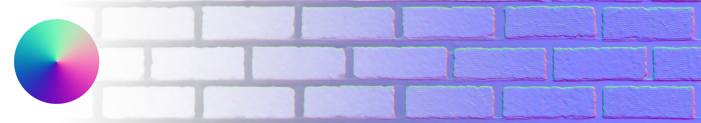
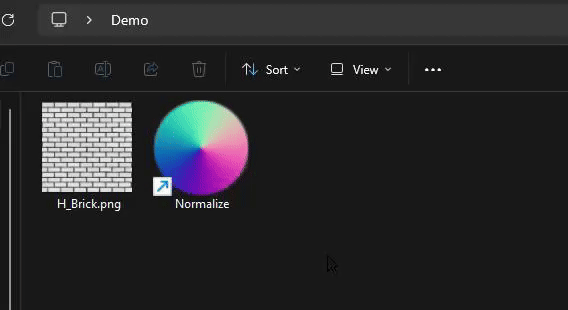
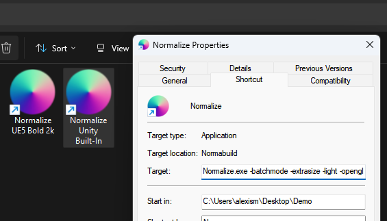
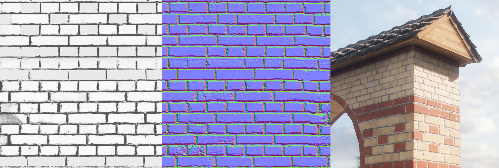

# Normalize
### Finally, A Zero-Click Normal Map Utility

For projects personal and professional alike, I bake a lot of normal maps from heightmaps. I can usually visualize height values pretty clearly in my head and so for most things that would usually deserve a real bake based on 3D geometry I just duke it out in handmade textures. This is much easier than going the full 3D loop and gives crisp results, but it's usually a little tedious; Most available options, software or web-based, assume you want to bake a million map types, never seem to remember what your settings are and generally have the thing you want behind way too many clicks. Let's not do that! 

## Usage

You drag your heightmap png/jpeg onto the Normalize executable... and that's it. It spits out the Normal Map in the same folder after a second or two. You're done! Isn't that nice? Now you can spend your time clicking on more relevant stuff.

## Customization

To keep in line with the "I know what I want and I want it as soon as possible" ethos, customizing Normalize to output normal maps that fit your project is incredibly straightforward:

- Create a shortcut to the Normalize executable somewhere.
- Customize the "Start In" path of your shortcut to *where you want the Normal Maps to be saved upon generation*. This can be the same location as the shortcut, the executable, your Assets folder - whatever.
- Add the appropriate launch parameters you want in the "Target" field.
- That's it! Now when you drag an image onto the shortcut it'll do your bidding based on what you ordered.

If you need different settings for some reason (eg. dual-wielding Unity & Unreal on the same computer), you just make more shortcuts. That's it! Quite a few launch parameters are available:

#### Output Normal Strength
The normal generation shader inside Normalize is tweaked to give the most Dynamic Range from the heightmap without clipping, but for compression or scale reasons you might want to adjust the strength of the normal.
- *-light*: Half-as-strong. Probably what you want if you won't scale it.
- *-bold*: Twice-as-strong. Clips lightly but would compress better if scaled up in-game.

#### Output Green Channel Direction
Defaults to DirectX-style green channel, used for Unreal & Unity HDRP.
- *opengl*: OpenGL-style green channel, used in the Unity Built-In RP.

#### Output Texture Size 
Defaults to the native heightmap size.
- *-smallsize*: 512px
- *-mediumsize*: 1024px
- *-largesize*: 2048px
- *-extrasize*: 4096px

#### Output Export Format
Defaults to png.
- *-encodetga*: Exports as a TGA
- *-encodejpeg*: Exports as a Jpeg

